# Panduan Lengkap Sistem Agentic SSDLC (Secure Software Development Life Cycle)

## 📋 Daftar Isi
1. [Pengenalan](#pengenalan)
2. [Arsitektur Sistem](#arsitektur-sistem)
3. [Agent-Agent yang Digunakan](#agent-agent-yang-digunakan)
4. [Alur Kerja (Workflow)](#alur-kerja-workflow)
5. [Flowchart Sistem](#flowchart-sistem)
6. [Detail Setiap Tahap](#detail-setiap-tahap)
7. [Cara Menggunakan](#cara-menggunakan)
8. [Teknologi yang Digunakan](#teknologi-yang-digunakan)

---

## 🎯 Pengenalan

Sistem **Agentic SSDLC** adalah platform otomatis yang menggunakan kecerdasan buatan untuk membantu pengembangan perangkat lunak yang aman. Sistem ini menggunakan beberapa agent AI yang bekerja sama untuk:

- 🤖 Melakukan interview otomatis untuk mengumpulkan kebutuhan
- 🛡️ Menganalisis keamanan aplikasi
- 🏗️ Membuat desain sistem yang aman
- 📚 Menghasilkan dokumentasi lengkap
- ⚡ Mempercepat proses pengembangan dengan otomatisasi

---

## 🏗️ Arsitektur Sistem

Sistem ini dibangun dengan arsitektur **Multi-Agent** yang menggunakan **LangGraph** sebagai orchestrator utama. Setiap agent memiliki tugas spesifik dan bekerja secara berurutan.

### Komponen Utama:
- **LangGraph Orchestrator**: Mengatur alur kerja antar agent
- **Intent Understanding Agent**: Memahami maksud pengguna
- **Specialized Agents**: Agent khusus untuk setiap tahap SSDLC
- **Memory System**: Menyimpan dan berbagi informasi antar agent
- **Documentation Generator**: Menghasilkan output dokumentasi

---

## 🤖 Agent-Agent yang Digunakan

### 1. **Intent Understanding Agent**
- **Fungsi**: Memahami maksud pengguna dari input chat
- **Tugas**: 
  - Menganalisis apakah user ingin membuat aplikasi baru
  - Menentukan tindakan selanjutnya (mulai workflow, lanjut, atau chat biasa)
  - Memberikan confidence score untuk setiap analisis

### 2. **Interview Agent**
- **Fungsi**: Melakukan wawancara untuk mengumpulkan kebutuhan
- **Tugas**:
  - Mengajukan pertanyaan tentang kebutuhan bisnis
  - Mengidentifikasi target pengguna
  - Mengumpulkan fitur-fitur yang diinginkan
  - Mencatat spesifikasi teknis

### 3. **Environment Agent**
- **Fungsi**: Menganalisis kebutuhan lingkungan teknis
- **Tugas**:
  - Menentukan sistem operasi yang didukung
  - Mengidentifikasi dependensi software
  - Menganalisis kebutuhan jaringan
  - Menetapkan baseline keamanan

### 4. **Security Agent**
- **Fungsi**: Membuat analisis keamanan aplikasi
- **Tugas**:
  - Mengidentifikasi peran pengguna
  - Menganalisis potensi aktor ancaman
  - Menentukan kontrol keamanan yang diperlukan
  - Merancang perlindungan data

### 5. **Misuse Case Agent**
- **Fungsi**: Mengidentifikasi skenario penyalahgunaan
- **Tugas**:
  - Membuat skenario serangan potensial
  - Menganalisis dampak setiap ancaman
  - Merancang mitigasi untuk setiap risiko

### 6. **Design Agent**
- **Fungsi**: Membuat desain sistem lengkap
- **Tugas**:
  - Mengkonsolidasi semua informasi sebelumnya
  - Merancang komponen sistem
  - Membuat diagram alur data
  - Menentukan interface eksternal

### 7. **Architecture Agent**
- **Fungsi**: Merancang arsitektur sistem
- **Tugas**:
  - Membuat arsitektur tingkat tinggi
  - Menentukan zona keamanan
  - Mengidentifikasi attack surface
  - Merancang trust boundaries

### 8. **Threat Model Agent**
- **Fungsi**: Melakukan pemodelan ancaman detail
- **Tugas**:
  - Menganalisis ancaman dengan metrik DREAD
  - Menghitung risk score untuk setiap ancaman
  - Memprioritaskan ancaman berdasarkan tingkat risiko
  - Merancang strategi mitigasi

### 9. **Documentation Agent**
- **Fungsi**: Menghasilkan dokumentasi final
- **Tugas**:
  - Mengkonsolidasi semua output agent
  - Membuat dokumentasi terstruktur
  - Menghasilkan file-file hasil (JSON, MD)
  - Membuat laporan ringkasan

---

## ⚡ Alur Kerja (Workflow)

Sistem bekerja dalam **9 tahap berurutan**:

1. **Intent Analysis** → Memahami maksud pengguna
2. **Interview** → Mengumpulkan kebutuhan aplikasi
3. **Environment Analysis** → Menganalisis kebutuhan teknis
4. **Security Requirements** → Membuat analisis keamanan
5. **Misuse Cases** → Mengidentifikasi skenario ancaman
6. **System Design** → Merancang arsitektur sistem
7. **Architecture** → Membuat arsitektur detail
8. **Threat Modeling** → Analisis ancaman mendalam
9. **Documentation** → Menghasilkan dokumentasi final

---

## 📊 Flowchart Sistem

```mermaid
flowchart TD
    A["`🚀 **START**
    User Input`"] --> B{"`🧠 **Intent Understanding Agent**
    Analisis maksud user`"}
    
    B -->|App Development| C["`📝 **Interview Agent**
    Wawancara kebutuhan bisnis
    - Nama proyek
    - Kebutuhan bisnis
    - Target pengguna
    - Fitur utama
    - Spesifikasi teknis`"]
    
    B -->|General Chat| Z["`💬 **Chat Mode**
    Percakapan umum`"]
    
    B -->|Help/Status| Z
    
    C --> D["`🖥️ **Environment Agent**
    Analisis lingkungan teknis
    - Sistem operasi
    - Dependencies
    - Kebutuhan jaringan
    - Baseline keamanan`"]
    
    D --> E["`🛡️ **Security Agent**
    Analisis kebutuhan keamanan
    - User roles
    - Threat actors
    - Security controls
    - Data protection`"]
    
    E --> F["`⚠️ **Misuse Case Agent**
    Identifikasi skenario ancaman
    - Attack scenarios
    - Impact analysis
    - Mitigation strategies`"]
    
    F --> G["`🏗️ **Design Agent**
    Desain sistem
    - Komponen sistem
    - Data flow
    - External interfaces
    - Trust boundaries`"]
    
    G --> H["`🏛️ **Architecture Agent**
    Arsitektur sistem
    - High-level architecture
    - Security zones
    - Attack surfaces`"]
    
    H --> I["`🎯 **Threat Model Agent**
    Pemodelan ancaman (DREAD)
    - Damage potential
    - Reproducibility
    - Exploitability
    - Affected users
    - Discoverability`"]
    
    I --> J["`📚 **Documentation Agent**
    Generate dokumentasi
    - JSON outputs
    - Markdown reports
    - Summary documents`"]
    
    J --> K["`✅ **FINISH**
    Dokumentasi lengkap
    siap digunakan`"]
    
    Z --> L["`🔄 **Continue Workflow**
    Kembali ke tahap aktif`"]
    
    L --> C
    
    style A fill:#e1f5fe
    style B fill:#fff3e0
    style C fill:#f3e5f5
    style D fill:#e8f5e8
    style E fill:#ffebee
    style F fill:#fff8e1
    style G fill:#e3f2fd
    style H fill:#f1f8e9
    style I fill:#fce4ec
    style J fill:#e0f2f1
    style K fill:#e8f5e8
    style Z fill:#f5f5f5
    style L fill:#f5f5f5
```



---

## 📋 Detail Setiap Tahap

### 1. **Intent Analysis Stage**
```
Input  : User chat message
Output : Intent classification (app_development/general_chat/help/status)
Tools  : LLM analysis, keyword matching
```

### 2. **Interview Stage**
```
Input  : User responses to questions
Output : InterviewResults (JSON)
Fields : projectName, businessNeeds, targetUsers, keyFeatures, technicalSpecs
```

### 3. **Environment Analysis Stage**
```
Input  : Interview results
Output : EnvironmentRequirements (JSON)
Fields : operatingSystem, dependencies, networkRequirements, securityBaseline
```

### 4. **Security Requirements Stage**
```
Input  : Interview + Environment results
Output : SecurityRequirements (JSON)
Fields : userRoles, threatActors, securityControls, dataProtection
```

### 5. **Misuse Cases Stage**
```
Input  : Previous results
Output : MisuseCases (JSON)
Fields : cases[id, name, actor, description, impact, mitigation]
```

### 6. **System Design Stage**
```
Input  : All previous results
Output : SystemDesign (JSON)
Fields : components, dataFlow, interfaces, trustBoundaries
```

### 7. **Architecture Stage**
```
Input  : System design + previous results
Output : SystemArchitecture (JSON)
Fields : architecture, components, securityZones, attackSurfaces
```

### 8. **Threat Modeling Stage**
```
Input  : Architecture + all previous results
Output : ThreatModel (JSON)
Fields : threats[id, name, description, targetAsset, risk{DREAD metrics}, mitigations]
```

### 9. **Documentation Stage**
```
Input  : All agent outputs
Output : Final documentation (MD files, summaries)
Process: Consolidate, format, generate readable documents
```

---

## 🚀 Cara Menggunakan

### 1. **Memulai Sistem**
```bash
python lang_graph.py
```

### 2. **Interaksi dengan Sistem**
- Ketik pesan untuk memulai, misalnya: "Saya ingin membuat aplikasi kasir"
- Sistem akan otomatis mengenali intent dan memulai workflow
- Jawab pertanyaan yang diajukan oleh setiap agent
- Tunggu hingga proses selesai

### 3. **Format Input yang Didukung**
- **Memulai pengembangan**: "Buat aplikasi baru", "Saya ingin membuat app kasir"
- **Chat umum**: Pertanyaan biasa atau percakapan
- **Status**: "Status workflow", "Di mana saya sekarang?"
- **Help**: "Help", "Apa yang bisa kamu lakukan?"

### 4. **Output yang Dihasilkan**
- File JSON untuk setiap tahap (Interview_Results.json, Security_Requirements.json, dll.)
- Dokumentasi Markdown dengan penjelasan lengkap
- Laporan ringkasan untuk manajemen

---

## 🛠️ Teknologi yang Digunakan

### **Core Technologies**
- **Python 3.11+**: Bahasa pemrograman utama
- **LangGraph**: Orchestration framework untuk multi-agent workflow
- **Pydantic**: Data validation dan serialization
- **Pydantic-AI**: Agent framework dengan type safety

### **AI/ML Components**
- **LLM Integration**: Support untuk berbagai model (OpenAI, Anthropic, dll.)
- **Intent Classification**: Natural language understanding
- **Conversational AI**: Multi-turn dialogue management

### **Data Management**
- **Memory System**: Persistent storage untuk sharing data antar agent
- **JSON Schema**: Structured output untuk setiap tahap
- **Document Tools**: Read/write/list documents dalam memory

### **Security & Compliance**
- **DREAD Methodology**: Risk assessment framework
- **SSDLC Best Practices**: Secure development lifecycle
- **Threat Modeling**: Systematic security analysis

### **User Interface**
- **Rich Console**: Beautiful terminal interface
- **Interactive CLI**: Real-time user interaction
- **Progress Tracking**: Visual workflow progress

---

## 📁 Struktur File Output

```
📦 Output Generated
├── 📄 Interview_Results.json          # Hasil wawancara kebutuhan
├── 📄 Environment_Requirements.json   # Analisis lingkungan teknis
├── 📄 Security_Requirements.json      # Kebutuhan keamanan
├── 📄 Misuse_Cases.json              # Skenario penyalahgunaan
├── 📄 System_Design.json             # Desain sistem
├── 📄 System_Architecture.json       # Arsitektur sistem
├── 📄 Threat_Model.json              # Model ancaman
├── 📄 Final_Documentation.md         # Dokumentasi lengkap
└── 📄 Executive_Summary.md           # Ringkasan untuk manajemen
```

---

## 🎯 Keunggulan Sistem

### **Otomatisasi Penuh**
- Workflow berjalan otomatis dari awal hingga akhir
- Minimal human intervention required
- Consistent process untuk setiap proyek

### **Komprehensif**
- Mencakup semua aspek SSDLC
- Security-first approach
- Dokumentasi lengkap dan terstruktur

### **Intelligent**
- Agent dapat memahami context dan memberikan rekomendasi
- Adaptif terhadap berbagai jenis aplikasi
- Learning dari best practices industri

### **Skalabel**
- Dapat digunakan untuk proyek kecil hingga enterprise
- Modular architecture memungkinkan customization
- Easy integration dengan tools existing

---

## 🔧 Konfigurasi dan Customization

### **Environment Setup**
```bash
# Install dependencies
pip install -r requirements.txt

# Set up environment variables
export OPENAI_API_KEY="your-api-key"
export ANTHROPIC_API_KEY="your-api-key"
```

### **Model Configuration**
- Sistem mendukung berbagai LLM provider
- Konfigurasi model dapat disesuaikan per agent
- Fallback mechanism untuk error handling

### **Memory Configuration**
- Persistent memory untuk long-running sessions
- Configurable storage backend
- Data retention policies

---

## 📞 Support dan Troubleshooting

### **Common Issues**
- **API Key Error**: Pastikan API key sudah di-set dengan benar
- **Memory Error**: Clear memory jika workflow terganggu
- **Timeout**: Increase timeout untuk model yang lambat

### **Logging**
- Sistem menyediakan detailed logging untuk debugging
- Log level dapat dikonfigurasi (DEBUG, INFO, WARNING, ERROR)
- Output log tersimpan dalam file untuk analisis

### **Best Practices**
- Berikan jawaban yang jelas dan spesifik saat interview
- Gunakan terminologi yang konsisten
- Review output setiap tahap sebelum melanjutkan

---

## 🚀 Roadmap dan Future Development

### **Planned Features**
- Web-based interface untuk kemudahan penggunaan
- Integration dengan tools development populer (GitHub, Jira, etc.)
- Multi-language support untuk dokumentasi
- Advanced threat modeling dengan ML

### **Performance Improvements**
- Parallel agent execution untuk workflow yang lebih cepat
- Caching mechanism untuk mengurangi API calls
- Optimized prompts untuk accuracy yang lebih baik

---

*Dokumentasi ini akan terus diperbarui seiring dengan perkembangan sistem. Untuk pertanyaan lebih lanjut, silakan hubungi tim development.*
