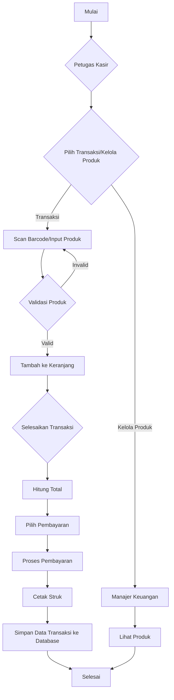

```mermaid
flowchart TD
    A[Mulai] --> B{Petugas Kasir}
    B --> C{Pilih Transaksi/Kelola Produk}
    C -- Transaksi --> D[Scan Barcode/Input Produk]
    D --> E{Validasi Produk}
    E -- Valid --> F[Tambah ke Keranjang]
    E -- Invalid --> D
    F --> G{Selesaikan Transaksi}
    G --> H[Hitung Total]
    H --> I[Pilih Pembayaran]
    I --> J[Proses Pembayaran]
    J --> K[Cetak Struk]
    K --> L[Simpan Data Transaksi ke Database]
    L --> M[Selesai]
    C -- Kelola Produk --> N[Manajer Keuangan]
    N --> O[Lihat Produk]
    O --> M
```
